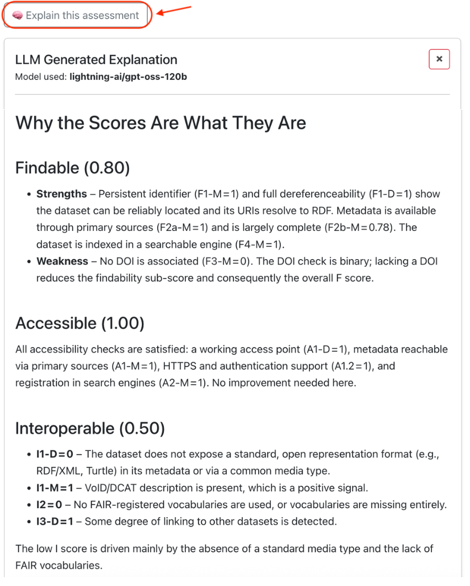

# FAIR-O: An Ontology for FAIR Assessment and Scoring

<p align="center">
	
</p>

FAIR-O provides a structured and extensible model for representing the evaluation of digital resources against the FAIR (Findable, Accessible, Interoperable, Reusable) principles. It supports detailed sub-principle results, evidence, scoring functions, and aggregation methods, with provenance-aware assessments aligned to the official FAIR Vocabulary.

## Overview

- Ontology IRI: https://w3id.org/fair-o
- DOI: [10.5281/zenodo.20027101](https://doi.org/10.5281/zenodo.20027101)
- License: CC BY 4.0
- Imports: PROV-O, SKOS, FAIR Vocabulary

## Repository structure

- Ontology: [FAIR-O.ttl](FAIR-O.ttl)
- SHACL shapes constrains: [FAIR-O_shape.ttl](FAIR-O_shape.ttl)
- Instance of the ontology with KGHeartBeat FAIR assessment results: [FAIR-O_data.ttl](FAIR-O_data.ttl)
- Integrated FAIR-O knowledge graph in TriG: [FAIR-O_data.trig](FAIR-O_data.trig)
- Modelled KGs from assessment tools:
  - KGHeartBeat assessment: [kgheartbeat_assessment_fair-o.ttl](data/KGHeartBeat_assessment/kgheartbeat_assessment_fair-o.ttl)
  - FairChecker assessment: [fairchecker_assessment_fair-o.ttl](data/FAIRChecker_assessment/fairchecker_assessment_fair-o.ttl)
  - F-UJI assessment: [fuji_assessment_fair-o.ttl](data/F-UJI_assessment/fuji_assessment_fair-o.ttl)
- Documentation (Widoco output): [docs/index.html](docs/index.html)
- Competency queries (SPARQL): [queries](queries)
- Query results: [results](results)
- Data snapshots and mappings: [data](data)
- Utility scripts: [src](src)

## Documentation

- Main docs page: [https://w3id.org/fair-o](https://w3id.org/fair-o)
- WebVOWL visualization: [https://gabrielet0.github.io/FAIR-O-An-Ontology-for-FAIR-Assessment-and-Scoring/webvowl/index.html#](https://gabrielet0.github.io/FAIR-O-An-Ontology-for-FAIR-Assessment-and-Scoring/webvowl/index.html#)
- Provenance report: [https://gabrielet0.github.io/FAIR-O-An-Ontology-for-FAIR-Assessment-and-Scoring/provenance/provenance-en.html](https://gabrielet0.github.io/FAIR-O-An-Ontology-for-FAIR-Assessment-and-Scoring/provenance/provenance-en.html)

## Use cases

### FAIR-O explanations in CHeCLOUD

FAIR-O assessment data was integrated into [CHeCLOUD](https://checloud.di.unisa.it/) to support the "Explain this assessment" feature. The integrated FAIR-O data improves LLM-generated explanations of FAIR scores by grounding them in structured assessment results, evidence, scoring functions, and provenance. This demonstrates how FAIR-O enables transparent, evidence-based explanations of FAIR assessments.



## Queries and results

The [queries](queries) folder contains competency queries (CQ1-CQ17) that exercise key modeling features of FAIR-O. The [results](results) folder includes example outputs and a summary CSV.

### Integrated results (results/integrated)

- The integrated KG is the root-level TriG dataset [FAIR-O_data.trig](FAIR-O_data.trig). It combines the FAIR-O assessment instances produced from KGHeartBeat, FairChecker, and F-UJI into one RDF dataset, while keeping each tool's assertions in separate named graphs so their results can be queried together and compared without losing provenance.
- The folder `results/integrated` contains the CSV outputs produced when CQs are executed over this integrated KG. These outputs are produced by running the query runner with the `--rebuild-integrated` or `--integrated` options.
- Key files you'll find there:
	- `FAIR-O_data.trig` (the integrated named-graph KG, stored at the repository root)
	- `cqs_results_csv.tar.gz` — a compressed archive containing the per-CQ CSV files
	- Individual `CQ*-*.csv` files produced by each competency query (CQ1–CQ17)
	- `cq-evaluation-summary.csv` — aggregated summary across CQs
	- `shacl-validation-report.ttl` — SHACL validation output for the integrated dataset

How to unpack and inspect the CSV results

```bash
# from the repository root
tar -xzf results/integrated/cqs_results_csv.tar.gz -C results/integrated
ls -lh results/integrated/*.csv
# quick preview of a CSV
head -n 20 results/integrated/CQ1-assessed-object.csv
```

How to reproduce the integrated dataset and run the integrated CQs

```bash
# build the integrated TriG and run all CQs (rebuilds named graphs from tool snapshots)
python src/run_queries.py --rebuild-integrated

# run queries against the existing integrated dataset (no rebuild)
python src/run_queries.py --integrated

# use Oxigraph engine for faster execution (if pyoxigraph is installed)
python src/run_queries.py --rebuild-integrated --engine oxigraph
```

Notes

- The integrated CSV outputs are generated from the union of tool-specific graphs, so they are useful to compare outcomes across tools for the same assessed objects and sub-principles.
- Column names in each CSV correspond to the SELECT variables of the CQ SPARQL files — inspect the corresponding query in the `queries/` folder for the exact mapping (for example, see `queries/CQ17-tool-results-for-object-subprinciple.rq`).
- If you need programmatic RDF output instead of CSV, [FAIR-O_data.trig](FAIR-O_data.trig) contains the full integrated FAIR-O KG produced by the conversion scripts.

## Scripts

The [src](src) folder includes helper scripts for cleaning descriptions, organizing TTL files, validating data, and running the SPARQL queries that populate the results folder. Conversion scripts are available to transform assessment outputs from different tools into FAIR-O instances:

- `kgheartbeat_to_fairo.py` — Convert KGHeartBeat assessment snapshots
- `fairchecker_to_fairo.py` — Convert FairChecker assessment output
- `fuji_to_fairo.py` — Convert F-UJI assessment output

## Regenerate data, run CQs, and validate SHACL

### Dependencies

The scripts rely on Python with `pandas`, `rdflib`, and `pyshacl` installed.
Install `pyoxigraph` to run integrated named-graph queries with the faster
Oxigraph SPARQL engine.

### Regenerate the FAIR-O instance from KGHeartBeat snapshots

From the repository root:

```bash
python src/kgheartbeat_to_fairo.py \
	--input-folder data \
	--mapping-json data/fair_mapping.json \
	--principles-doc data/fair_principle_doc.json \
	--output FAIR-O_data.ttl \
	--organize
```

### Execute competency queries (CQs)

```bash
python src/run_queries.py
```

Results are written to [results](results) and summarized in [results/cq-evaluation-summary.csv](results/cq-evaluation-summary.csv).

To build one RDF dataset containing all three tools in separate named graphs and
execute the CQs over their union:

```bash
python src/run_queries.py --rebuild-integrated
```

To reproduce the three integrated CQs used in the article without exporting the full result set for every CQ:

```bash
python src/run_queries.py --integrated --engine oxigraph \
	--queries CQ15 CQ16 CQ17 \
	--object https://w3id.org/fair-o/resource/dataset_2000-us-census-rdf \
	--sub-principle https://w3id.org/fair/principles/terms/A1.2
```

The integrated dataset is written as TriG to [FAIR-O_data.trig](FAIR-O_data.trig).
It is an integrated KG because it brings the three tool-specific FAIR-O
assessment graphs into one RDF dataset: assessed objects use canonical shared
IRIs, while tool-owned assessments, results, algorithms, and scoring functions
remain in tool-specific named graphs and namespaces.

### Validate data with SHACL constraints

```bash
python src/validate_data.py \
	--data FAIR-O_data.ttl \
	--shapes FAIR-O_shape.ttl \
	--ontology FAIR-O.ttl \
	--report results/shacl-validation-report.ttl
```

The command prints the validation report and returns a non-zero exit code when constraints are violated.

## License

Released under the Creative Commons Attribution 4.0 International (CC BY 4.0) license. See [LICENSE](LICENSE).
